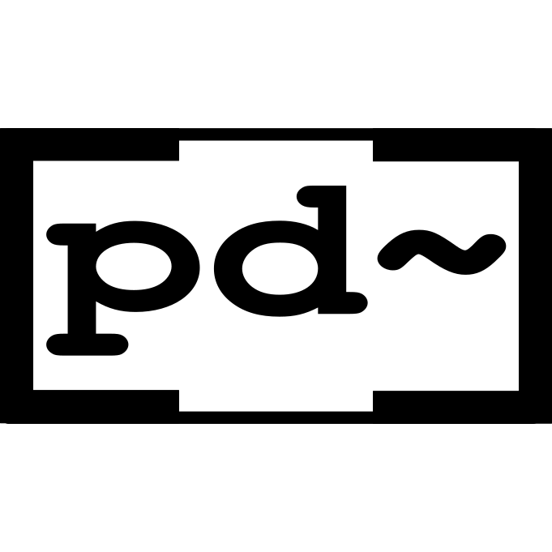

# Charles Matthews
Technical audio and music designer

## Unreal Engine plugin development
[Branches: Metasound Plugins](https://github.com/matthewscharles/metasound-branches)

    <iframe width="640" height="390" 
    src="https://www.youtube.com/embed/HgudP5fzDWM" 
    frameborder="0" allowfullscreen></iframe>

